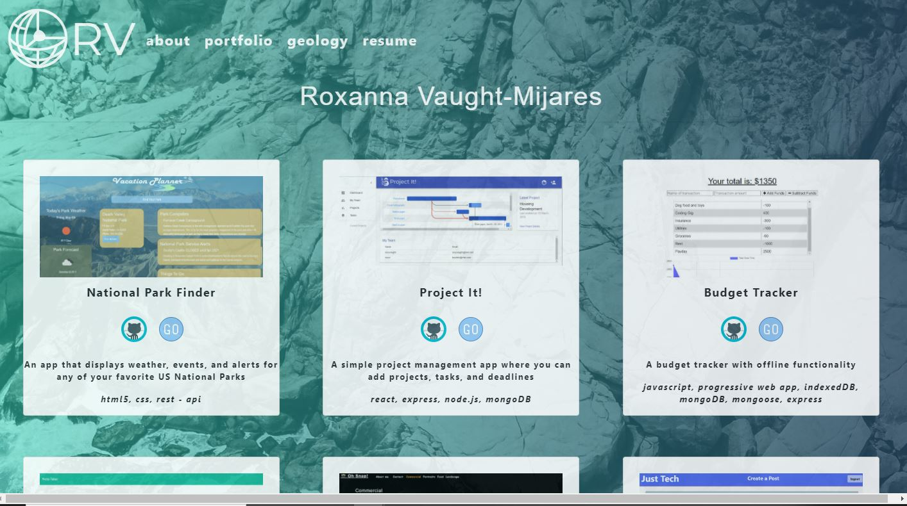

# Professional React Portfolio
  My professional portfolio redone in React. The deployed page can be found [here](http://roxyvaught.github.io/react-portfolio)

  

  ## Badges 
  

  ## Table of Contents 
  * [Description](#description)
  * [Installation](#installation)
  * [Usage](#usage)
  * [Contributions](#contributions)
  * [Test](#test)
  * [License](#license)
  * [Questions](#questions)

  ## Installation
  Clone the repo and run `npm install` followed by `npm start`
  
  ## Usage
  Run the following command in the command line and answer the questions Run `npm start`

  ## Contributions
  None at this time
  
  ## Test
  N/A

  ## License
  Licensed under the Unlicense license

  ## Questions
  Have any questions? Email me at roxanna.vaught@gmail.com

